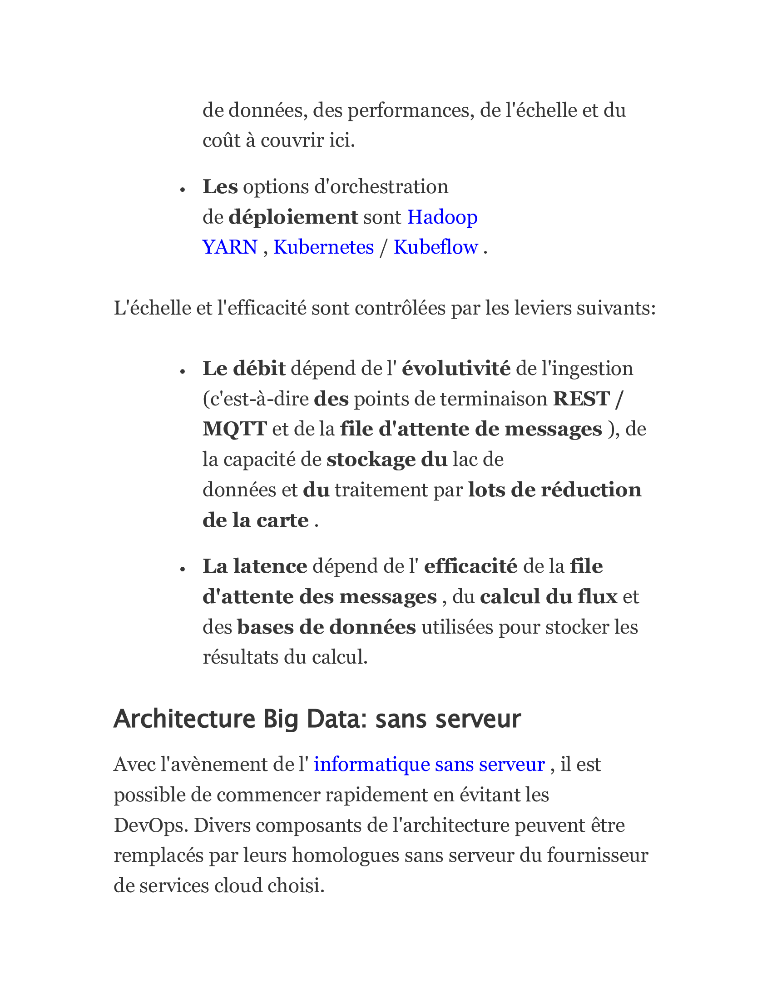

# Architecture-Big-Data
Des pipelines de données évolutifs et efficaces sont aussi importants pour le succès de l'analyse, de la science des données et de l'apprentissage automatique que des lignes d'approvisionnement fiables pour gagner une guerre.

